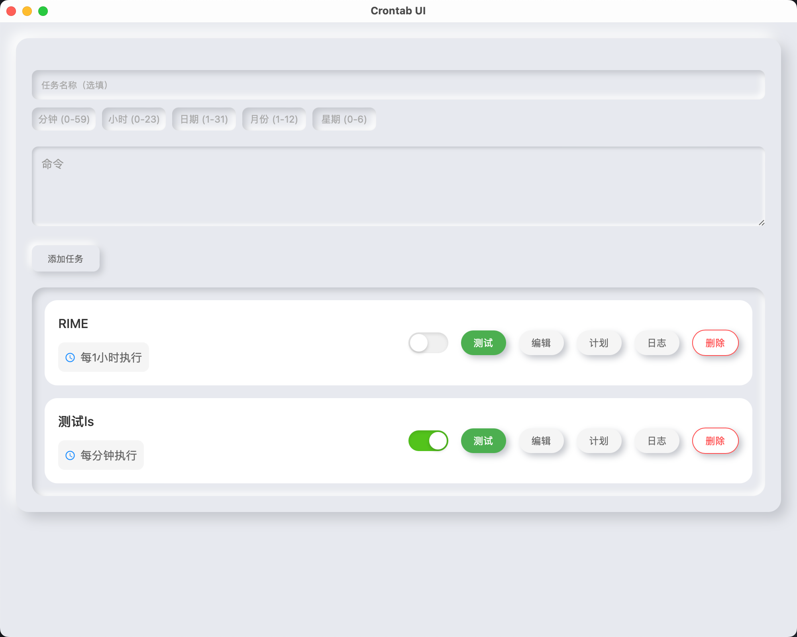

# Crontab UI FOR MacOS

一个现代化的 crontab 管理工具，使用 Tauri + React + TypeScript 构建。



## 功能特点

- 🚀 直观的图形界面管理 crontab 任务
- 📊 实时显示任务状态
- 🔄 自动计算下次执行时间
- 📝 支持标准 cron 表达式
- 🧪 内置命令测试功能
- 📋 详细的执行日志查看
- 🔒 自动处理权限问题
- 🐍 自动管理 Python 环境和依赖

## 系统要求

- macOS 10.15+

## 安装

### 从源码构建

```bash
# 克隆仓库
git clone https://github.com/genkin-he/crontab-ui.git
cd crontab-ui
# 安装依赖
npm install
# 开发模式运行
npm run tauri dev
# 构建发行版
npm run tauri build
```
